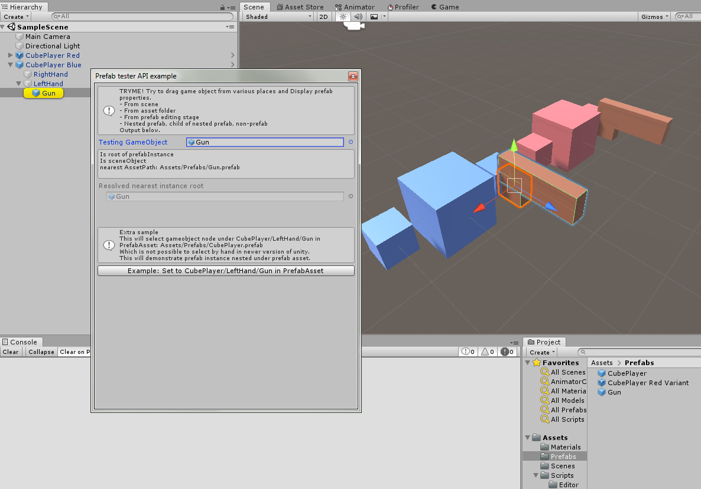

# UnityPrefabTester

Update: Project version is now 2020.1.3f

Ultimate prefab property tester for nested prefab era.
This is editor script to demonstrate ALL* prefab related API in Unity Editor.
*(Except prefab variant related)

It will test/distinguish selected game object if it is "part of" or "root of" any prefab type.
Including
- Prefab Asset (The one that sits in Asset folder)
- Prefab Instance (The one that dragged into scene)
- Prefab Stage (Editing prefab intermediate in UnityEditor prefab edit mode)

Including resolve nearest asset path, root of prefab if available.

To try the example API, import package or open demo project.
Select menu Tool->Prefab tester API example

## Related API used:
- PrefabUtility.IsPartOfPrefabAsset
- PrefabUtility.GetNearestPrefabInstanceRoot
- PrefabStageUtility.GetCurrentPrefabStage
- PrefabUtility.GetPrefabAssetPathOfNearestInstanceRoot
- AssetDatabase.GetAssetPath

## Possible useful scenario:
- Useful for some editor script automation based on prefabs.
- Originally, I write this code to fix [Mirror network plugin](https://github.com/vis2k/Mirror) issue on determining assetPath on NetworkIdentity in complex cases which my game is using.